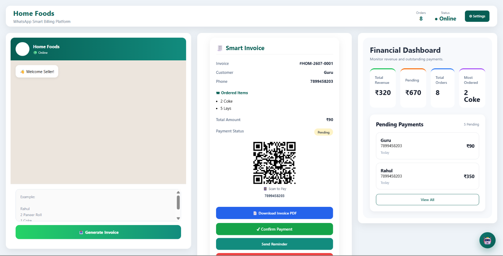

<div align="center">

# 📱 ApnaKhata — WhatsApp Smart Billing Assistant

### Smart Billing & Payment Management Platform for Small Businesses

Transform WhatsApp orders into professional invoices, track payments, manage your business, and gain AI-powered insights — all from one simple platform.

<br>


<br>

> **Paste → Generate → Track → Get Paid**

</div>

---

# ✨ Overview

**ApnaKhata — WhatsApp Smart Billing Assistant** is a lightweight smart billing platform designed for small and home-based businesses that receive customer orders through **WhatsApp**.

Instead of manually creating bills and tracking payments, sellers can paste customer order details into the application and automatically generate structured invoices.

The platform also provides secure user authentication, business-specific data management, payment tracking, business analytics, AI-powered insights, and regional language support.

The application currently supports **English and Kannada**, helping make digital billing more accessible to regional-language users.

---

# 📸 Application Preview

<p align="center">
  
</p>

---

# 🚀 Features

| Feature | Description |
|---------|-------------|
| 🔐 User Authentication | Secure user registration and login |
| 🏪 Business Profiles | Each user can create and manage their own business profile |
| 📱 WhatsApp Order Parser | Convert WhatsApp-style order messages into structured orders |
| 🧾 Smart Invoice | Automatically generate professional invoices |
| 📄 PDF Export | Generate and download printable PDF invoices |
| 💳 Payment Tracking | Track invoices as Paid or Pending |
| 📲 WhatsApp Reminder | Send payment reminders to customers |
| 📊 Financial Dashboard | Monitor revenue, total orders, pending payments, and top-selling products |
| 🏆 Product Insights | Identify top-selling products based on order history |
| 🤖 AI Assistant | Get business summaries and intelligent recommendations |
| 🔍 Invoice History | Search, view, and manage previous invoices |
| ⚙️ Business Settings | Manage business details, contact information, UPI details, and preferences |
| 🌐 Regional Language Support | Switch the application interface between English and Kannada |
| ☁️ Cloud Database | Store user, business, and invoice data using Supabase PostgreSQL |
| 🔒 User-Specific Data | Business profiles and invoices are associated with individual authenticated users |

---

# 🌐 Regional Language Support

ApnaKhata is designed with accessibility for regional businesses in mind.

The application currently supports:

- 🇬🇧 **English**
- 🇮🇳 **Kannada (ಕನ್ನಡ)**

Users can select their preferred language and switch between English and Kannada through the Business Settings interface.

The selected language dynamically updates supported sections of the application, including the financial dashboard, business settings, and other localized interface elements.

Additional Indian regional languages can be integrated in future versions.

---

# 🔐 Authentication & User Management

The platform includes a dedicated authentication system that allows users to:

- Create a new account
- Securely log in to their account
- Access their own business dashboard
- Create and update their business profile
- Access only their associated invoices and business data
- Securely log out

Authentication is handled using **JWT (JSON Web Tokens)**, while passwords are securely hashed before being stored.

---

# 🛠 Tech Stack

| Frontend | Backend | Database | Libraries / Services |
|-----------|---------|----------|----------------------|
| React 19 | Node.js | Supabase PostgreSQL | jsPDF |
| Vite | Express.js | PostgreSQL | React QR Code |
| CSS | REST API | | bcryptjs |
| React Router | JWT Authentication | | JSON Web Token |
| React Icons | | | QRCode |

---

# ☁️ Deployment Architecture

The application uses a cloud-based deployment architecture:

```text
User
  │
  ▼
React Frontend
(Vercel)
  │
  │ REST API
  ▼
Node.js + Express Backend
(Render)
  │
  ▼
Supabase PostgreSQL
(Cloud Database)
```

- **Frontend:** Deployed on Vercel
- **Backend:** Deployed on Render
- **Database:** Hosted using Supabase PostgreSQL

---

# 📂 Project Structure

```text
WhatsApp-Smart-Billing
│
├── client
│   ├── screenshots
│   ├── public
│   └── src
│       ├── assets
│       ├── components
│       ├── context
│       │   └── LanguageContext.jsx
│       ├── pages
│       │   ├── Login.jsx
│       │   ├── Register.jsx
│       │   ├── BusinessSetup.jsx
│       │   └── Dashboard.jsx
│       ├── translations
│       │   ├── en.js
│       │   └── kn.js
│       └── utils
│
├── server
│   ├── db.js
│   └── server.js
│
└── README.md
```

---

# ⚡ Getting Started

## 1. Clone Repository

```bash
git clone https://github.com/hriishi5/WhatsApp-Smart-Billing.git
cd WhatsApp-Smart-Billing
```

---

## 2. Backend Setup

```bash
cd server
npm install
```

Create a `.env` file inside the `server` directory:

```env
DATABASE_URL=your_supabase_postgresql_connection_string
JWT_SECRET=your_jwt_secret
```

Start the backend:

```bash
npm run dev
```

or:

```bash
npm start
```

The backend runs locally on:

```text
http://localhost:5000
```

---

## 3. Frontend Setup

```bash
cd client
npm install
```

Create a `.env` file inside the `client` directory:

```env
VITE_API_URL=http://localhost:5000
```

Start the frontend:

```bash
npm run dev
```

The frontend runs locally on:

```text
http://localhost:5173
```

---

# 🗄️ Database

The project uses **Supabase PostgreSQL** as its cloud database.

The database stores information related to:

- Users
- Business profiles
- Invoices
- Payment status
- Customer and order information

Each business and invoice is associated with its respective authenticated user, allowing multiple users to maintain independent business data.

---

# 🌟 Highlights

✅ Secure User Registration & Login

✅ User-Specific Business Profiles

✅ Supabase PostgreSQL Cloud Database

✅ Dynamic Invoice Generation

✅ Dynamic Monthly Invoice IDs

✅ QR Code / UPI Payment Support

✅ Professional PDF Invoice Generation

✅ Paid & Pending Payment Tracking

✅ WhatsApp Payment Reminders

✅ Financial Analytics Dashboard

✅ Top-Selling Product Insights

✅ AI Business Assistant

✅ English & Kannada Localization

✅ Cloud-Deployed Frontend and Backend

---

# 🚀 Future Scope

The project is actively evolving with several planned enhancements:

- 🌐 Support for additional Indian regional languages
- 📦 Inventory & Stock Management
- 💳 Automated Payment Verification through payment gateways
- 📧 Email Invoice & Digital Receipt Generation
- 📊 Detailed Sales Analytics & Exportable Reports
- 👥 Role-Based Access Control for business teams
- 📱 Native Mobile Application for Android & iOS
- 🤖 AI-powered Sales Forecasting and Business Recommendations
- 🔔 Automated Payment Notifications
- 📈 Advanced Business Performance Analytics

---

<div align="center">

## 👨‍💻 Developers

### **Team Avengers**

B.Tech Students

Made with ❤️ using React, Node.js & Supabase

⭐ **If you like this project, consider giving it a Star!**

</div>